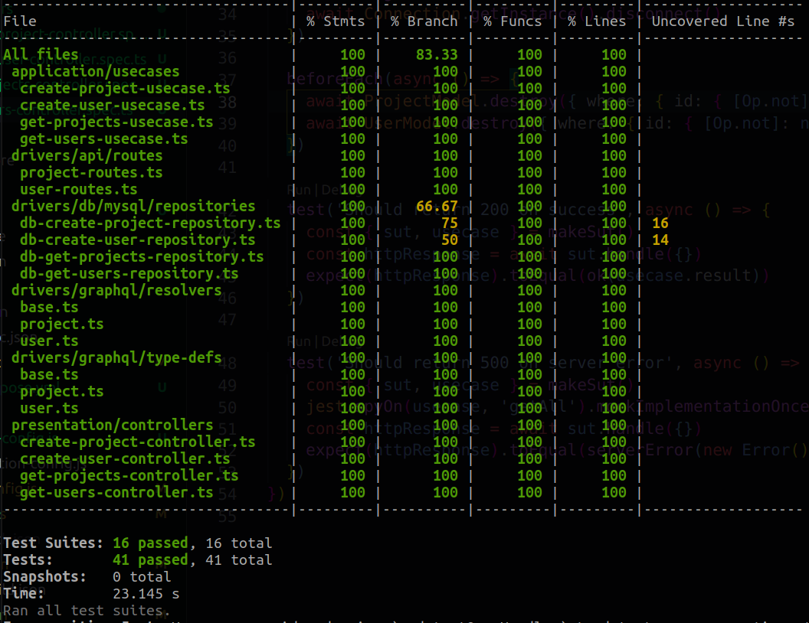

# Challenge Project for SolarView

## 1. Requirements

- Create a Node Graphql API based on the queries and mutations described on [README.md](./README.md).
- Feel free to choose the way that you will pass the input data (queries and mutations)
- Use your creativity to improve what you want.

## 2. Setup instructions

Make shure to have access to an mysql database server and a user with administration rights (to create the databases, one for production and another for testing)

### 2.1. Clone repository and install dependencies

```bash
git clone https://github.com/leandrosnx/back-challenge-graphql.git
cd back-challenge-graphql 
```

### 2.2. Setup environment variables

Copy the .env.example and rename to .env

On .env file, set all env vars to point the project to your database

```bash
PORT=5050
MYSQL_HOSTNAME=
MYSQL_DATABASE=
MYSQL_USERNAME=
MYSQL_PASSWORD=
```

### 2.3. Install dependencies and Build project

To build the project, run the command below (**optional step if you will run with docker**)

```bash
npm install
npm run build
```

### 2.4. Run with Docker

Make sure you have docker-compose installed (install instructions in [Official Website](https://docs.docker.com/compose/install/))

```bash
npm run docker:up
```

### 2.5. Run locally

By default, this Api run's on 5050 port, if you have troubles, check if this port is free.

```bash
npm start
```

### 2.6. Debug and Inspect

You can use nodejs inspection feature to debug the source code using VS Code.

**Run this scripts in two separated terminals!**

1. Build and watch changes on src directory to rebuild:

```bas
npm run build:watch
```

2. Use nodemon to watch changes on dist folder and restar server:

```bash
npm run debug
```

### 2.7. Consuming API

You can consume this api with REST and GraphQL:

After start server, you can:

- import postman collection from **docs/challange-solarview.postman_collection.json** or 
- use Appollo Server Playground at [http://localhost:5050/graphql](http://localhost:5050/graphql)

### 2.8. Migrations and Seeds

To create migrations and seed you can just use this following commands:

Migration are stored on {src,dist}/drivers/db/migrations

```bas
npm run migration:create ExamplaMigration
```

Seeds are stored on {src,dist}/drivers/db/seeds

```bas
npm run seed:create ExampleMigration
```

### 2.9. Testing

To test this api, you will need a separated database.

**Jest** uses the **.env.test** to establish connection with this database:

On jest config file, we use the method setupFIles to manage the .env file

```type
#! jest.config
...
setupFiles: [
  '<rootDir>/jest-dotenv-config.js'
]
...
```

In the dot env configuration, we just import the desired .env file

```type
#! jest-dotenv-config.js
require('dotenv').config({
  path: '.env.test'
})
```

To handle with migrations during the test process, we use [**Umzug**](https://www.npmjs.com/package/umzug) library.

### 2.10. Running tests

Unit tests with watch mode:

```bas
npm run test:unit
```

Integration Tests with watch mode:

```bas
npm run test:integration
```

To see the coverage report, just run:

```bas
npm run test:ci
```

For CI/CD purposes run just:

```bas
npm run test
```

### 2.11. Current coverage Report
<p align="center">
  
</p>


------

## 3. How did you decide which technologies to use as part of your solution?

<p align="center">
  
</p>

I decided to use the clean architecture concepts because:

- **DDD**: the business logic of the application stay's isolated of the implementation it self. We can decide how we can implement. Is this case, the same application can be Consumed by REST or GraphQL.
- **IOC and Dependecy Inversion Principle**: the core business is not affected by third party libraries or external applications, such as databases and external api's. If we need to change any third party library or event the database, we just need to change a few parts of the application with little effort.
- **Single Responsibility** Principle: every piece of code there's your own responsibility in the solution, with small pieces, we can more efficient test with less effort.
- **Interface Segregation**: Typescript help us with the strict type checking, i used interfaces to manage the communications between all components.
- **Dependency injection**: I used the Factory Design pattern to reuse the resources on application, instead instantiate classes every time. This can bring performance improvements.

About the libraries and frameworks:

Theres no main framework in this solution, just removable parts.

- **ExpressJs**: i chose express because it easy to use api framework with a great route handler.
- **Mysql**: There are many questions about database performances, but still, i prefer to use Postgres Sql.
- **Sequelize**: I chose because were a requirement, if i can choose another, maybe TypeOrm will be the one. Every ORM have hundreds of layers of processing, this costs a lot when we work with large scale applications. In this case, i would think to use the native libraries of databases, with some helpers, maybe both together.
- **sequelize-typescript insted of sequelize**: i think that this version is more readable and works fine with typescript types.
- **graphql**: I chose because were a requirement, i prefer use rest instead. But in large applications i experienced the use of **gRPC**, that is much faster and can run natively on web applications. I think that the cons of graphql brings to solution are less than the pros.
- **Jest**: this library is highly used by the community and have great functionalities, i have been using this lib in all my projects.

## 4. Are there any improvements you could make to your submission?

Yes, there are many improvements that can be done. I think that any applications can be always improved.

1. Improve the test coverage
2. Implement the filters and pagination: i forgot to implement this, sorry.  But its very easy to implement.

## 5. What would you do differently if you were allocated more time?

1. Better test architecture and test more things
2. Pipeline scripts and CI/CD
3. Cloud deploy with serverless
4. Better documentation: create auto-generated open api documentation with swagger.
