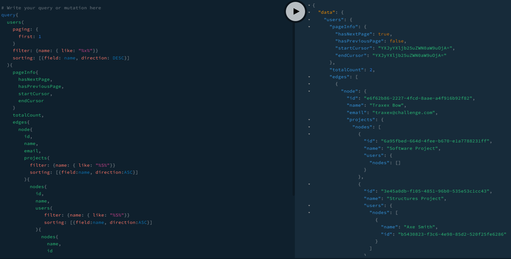

# CHALLENGE APP



This project was bootstrapped with [NestJS](https://docs.nestjs.com/) <br/>

# Requirements

- Create a Node Graphql API based on the queries and mutations. Learn more at [README.md](./README.md).
- Feel free to choose the way that you will pass the input data (queries and mutations)
- Use your creativity to improve what you want.

Learn More:

- [CHALLENGE APP](#challenge-app)
- [Requirements](#requirements)
- [Technologies](#technologies)
- [How to run with docker](#how-to-run-with-docker)
- [How to run with yarn](#how-to-run-with-yarn)
- [How to run tests](#how-to-run-tests)
- [How did you decide which technologies to use as part of your solution](#how-did-you-decide-which-technologies-to-use-as-part-of-your-solution)
- [Are there any improvements you could make to your submission](#are-there-any-improvements-you-could-make-to-your-submission)
- [What would you do differently if you were allocated more time](#what-would-you-do-differently-if-you-were-allocated-more-time)


# Technologies

- [NestJS](https://nestjs.com/)
- [Sequelize TypeScript](https://github.com/RobinBuschmann/sequelize-typescript)
- [Apollo Graphql](https://www.apollographql.com/)
- [Nestjs Query](https://doug-martin.github.io/nestjs-query/)
- [Helmet](https://helmetjs.github.io/)
- [Class Validator](https://github.com/typestack/class-validator)
- [Class Transformer](https://github.com/typestack/class-validator)
- [Jest](https://jestjs.io/)
- [Supertest](https://github.com/visionmedia/supertest)
- [Node](https://nodejs.org/)
- [PostgreSQL](https://www.postgresql.org/)
- [Docker](https://www.docker.com/)
  
# How to run with docker

- With [docker](https://docs.docker.com/install/ 'docker') and [docker compose](https://docs.docker.com/compose/install/ 'docker compose') installed, run the following:

```
git clone https://github.com/rafaelfigueiredo-l/back-challenge-graphql
cd back-challenge-graphql
cp .env.example .env
yarn install
docker-compose up
```

After docker create containers you can access the app at:

- http://localhost:3005/graphql

# How to run with yarn

Open .env.example and change the vars to connect to your database.

```
git clone https://github.com/rafaelfigueiredo-l/back-challenge-graphql
cd back-challenge-graphql
yarn install
cp .env.example .env
yarn start
```

# How to run tests

The tests runs in a separate database using the node_env=test environment.
You are able to create a PostgreSQL database using the docker command: `docker-compose -f docker-compose-test.yml up`

```
cd app
yarn test
yarn test:e2e
yarn test:cov
```

# How did you decide which technologies to use as part of your solution
I decided to use NestJS because the challenge asks for a well designed architeture that can be easily consumed by REST or GraphQL.
Using Single Responsibility, Dependency Inversion Principle, Interface Segregation and Dependency injection I was able to create well defined contracts and needed tests.

# Are there any improvements you could make to your submission
Talking about software development, I think every app is possible to improve in some aspect. 

- Created more tests

# What would you do differently if you were allocated more time

- Added Authentication
- Created pipelines scripts for CI/CD
- Improvements with docs